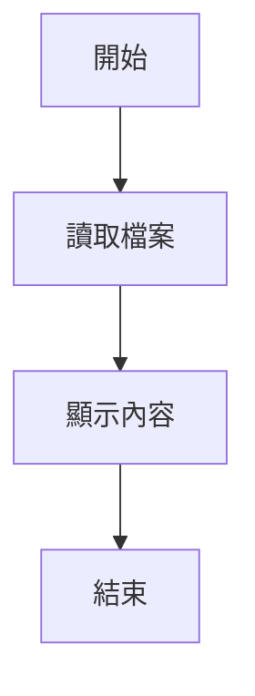
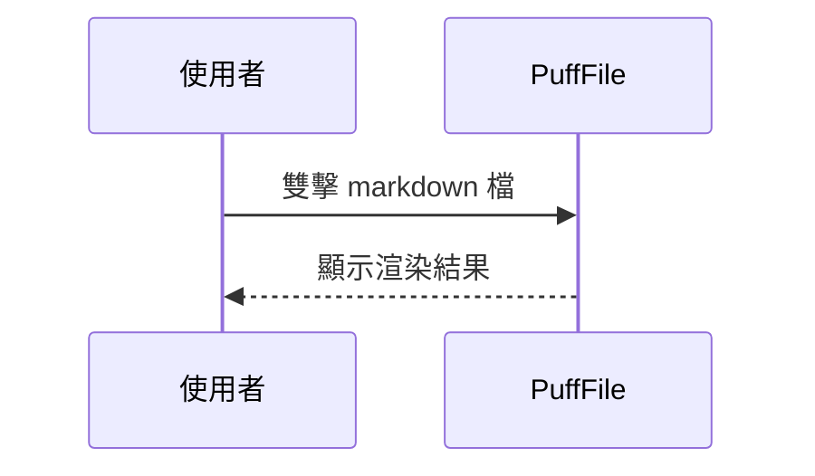
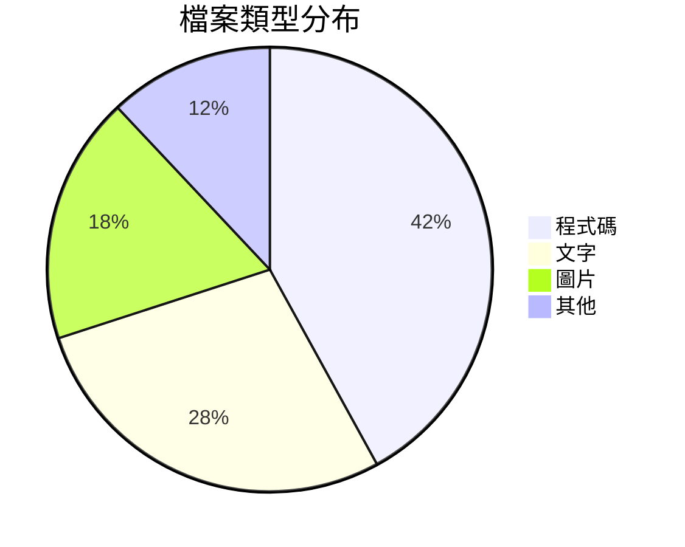
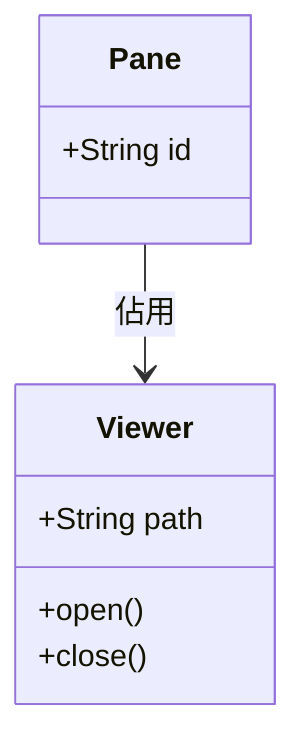

# Mermaid 測試 1：基本圖

最單純的四種圖。**這一組應該全部正常渲染** —— 如果連這裡都失敗，問題在引擎載入或
檢視器的 Mermaid 管線，而不是個別圖表的語法。

可以順便看這幾件事：

1. 有沒有畫出圖（而不是只留原始碼）。
2. 標題列的「圖表／原始碼」切換、複製原始碼、另存 PNG 是否都有作用。
3. 中文字有沒有變成方框或亂碼（`htmlLabels:false` 走的是 SVG `text`）。
4. 左上角的目錄索引是否依這幾個 `##` 標題產生。

## 1. 流程圖（4 個節點）

## 2. 循序圖（2 個參與者）

## 3. 圓餅圖（4 個值）

## 4. 類別圖（2 個類別）

