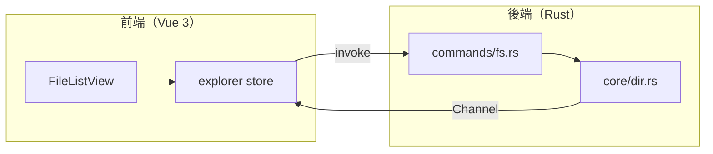
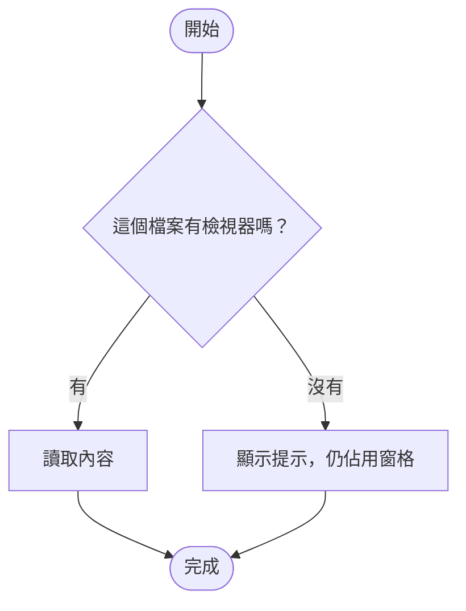
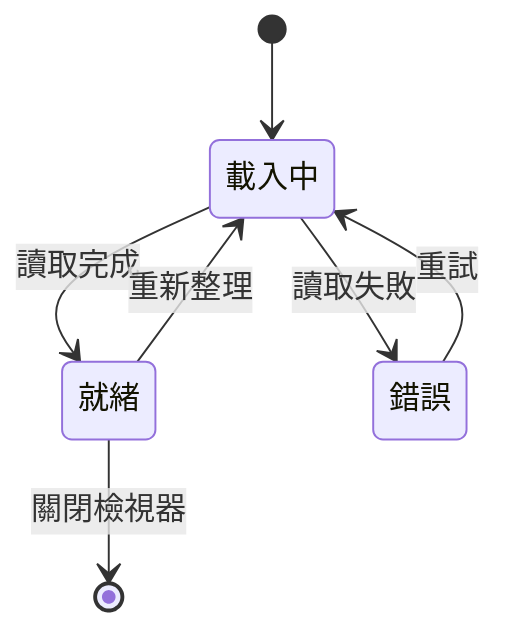
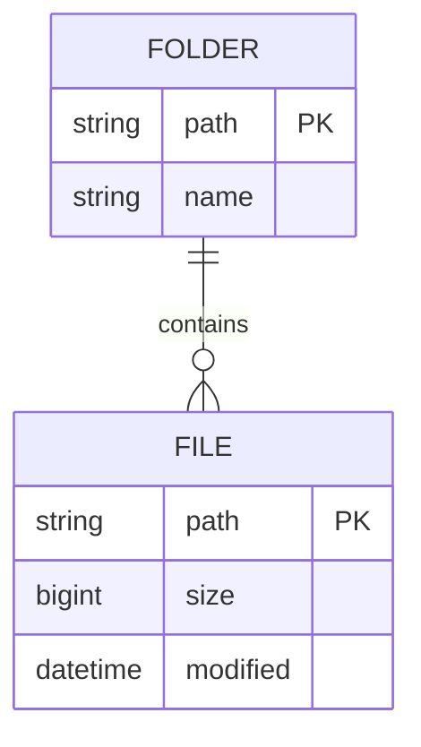
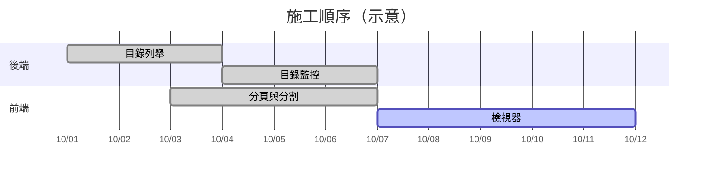
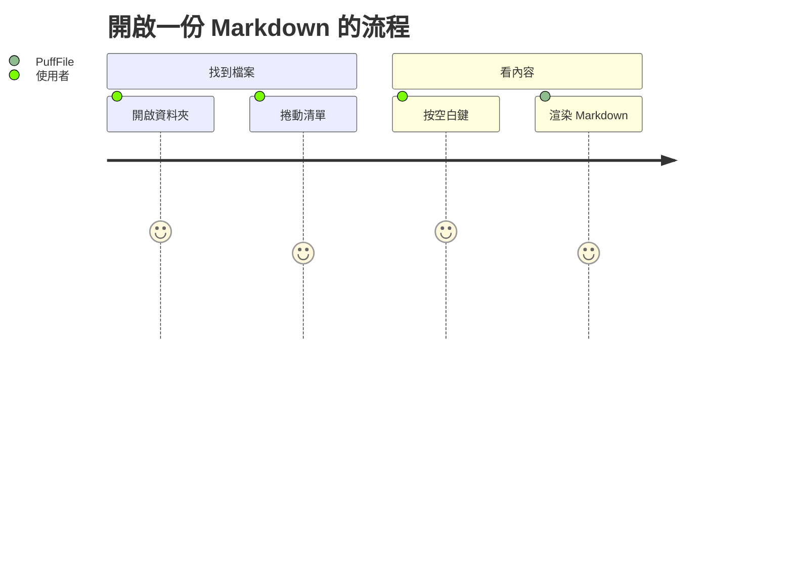
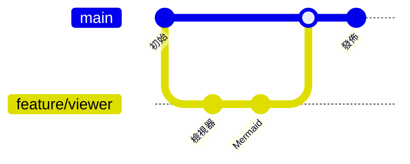

# Mermaid 測試 2：進階圖

分支、巢狀群組、狀態、關聯、時間排程。**這一組也應該全部正常渲染。**

## 1. 流程圖：群組與箭頭標籤

```mermaid
flowchart LR
    subgraph FE["前端（Vue 3）"]
        UI[FileListView]
        Store[explorer store]
    end
    subgraph BE["後端（Rust）"]
        Cmd[commands/fs.rs]
        Core[core/dir.rs]
    end
    UI --> Store
    Store -->|invoke| Cmd
    Cmd --> Core
    Core -->|Channel| Store
```

## 2. 流程圖：判斷分支

```mermaid
flowchart TD
    Start([開始]) --> Check{這個檔案有檢視器嗎？}
    Check -->|有| Load[讀取內容]
    Check -->|沒有| Notice[顯示提示，仍佔用窗格]
    Load --> Done([完成])
    Notice --> Done
```

## 3. 狀態圖

```mermaid
stateDiagram-v2
    state "載入中" as Loading
    state "就緒" as Ready
    state "錯誤" as Failed
    [*] --> Loading
    Loading --> Ready : 讀取完成
    Loading --> Failed : 讀取失敗
    Ready --> Loading : 重新整理
    Failed --> Loading : 重試
    Ready --> [*] : 關閉檢視器
```

## 4. 實體關聯圖

```mermaid
erDiagram
    FOLDER ||--o{ FILE : contains
    FOLDER {
        string path PK
        string name
    }
    FILE {
        string path PK
        bigint size
        datetime modified
    }
```

## 5. 甘特圖

```mermaid
gantt
    title 施工順序（示意）
    dateFormat YYYY-MM-DD
    axisFormat %m/%d
    section 後端
    目錄列舉        :done, a1, 2026-10-01, 3d
    目錄監控        :done, a2, after a1, 3d
    section 前端
    分頁與分割      :done, b1, 2026-10-03, 4d
    檢視器          :active, b2, after b1, 5d
```

## 6. 使用者旅程圖

```mermaid
journey
    title 開啟一份 Markdown 的流程
    section 找到檔案
      開啟資料夾: 5: 使用者
      捲動清單: 4: 使用者
    section 看內容
      按空白鍵: 5: 使用者
      渲染 Markdown: 4: PuffFile
```

## 7. Git 圖

```mermaid
gitGraph
    commit id: "初始"
    branch feature/viewer
    checkout feature/viewer
    commit id: "檢視器"
    commit id: "Mermaid"
    checkout main
    merge feature/viewer
    commit id: "發佈"
```
