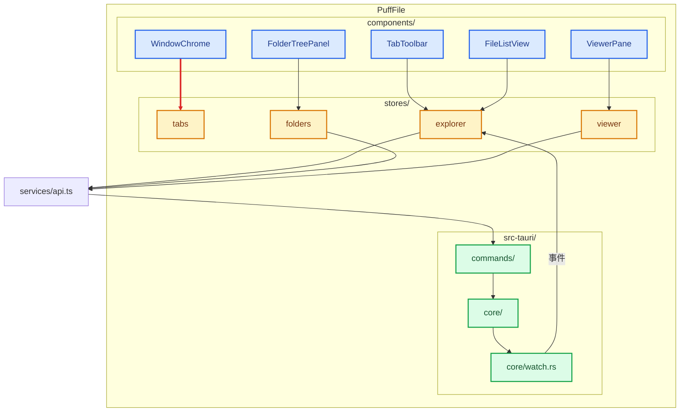
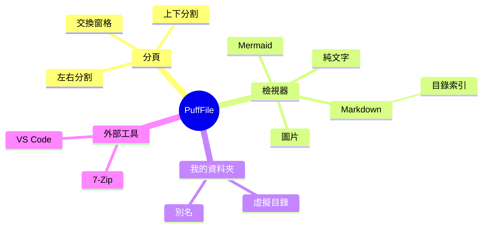
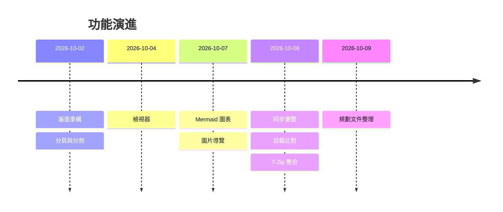
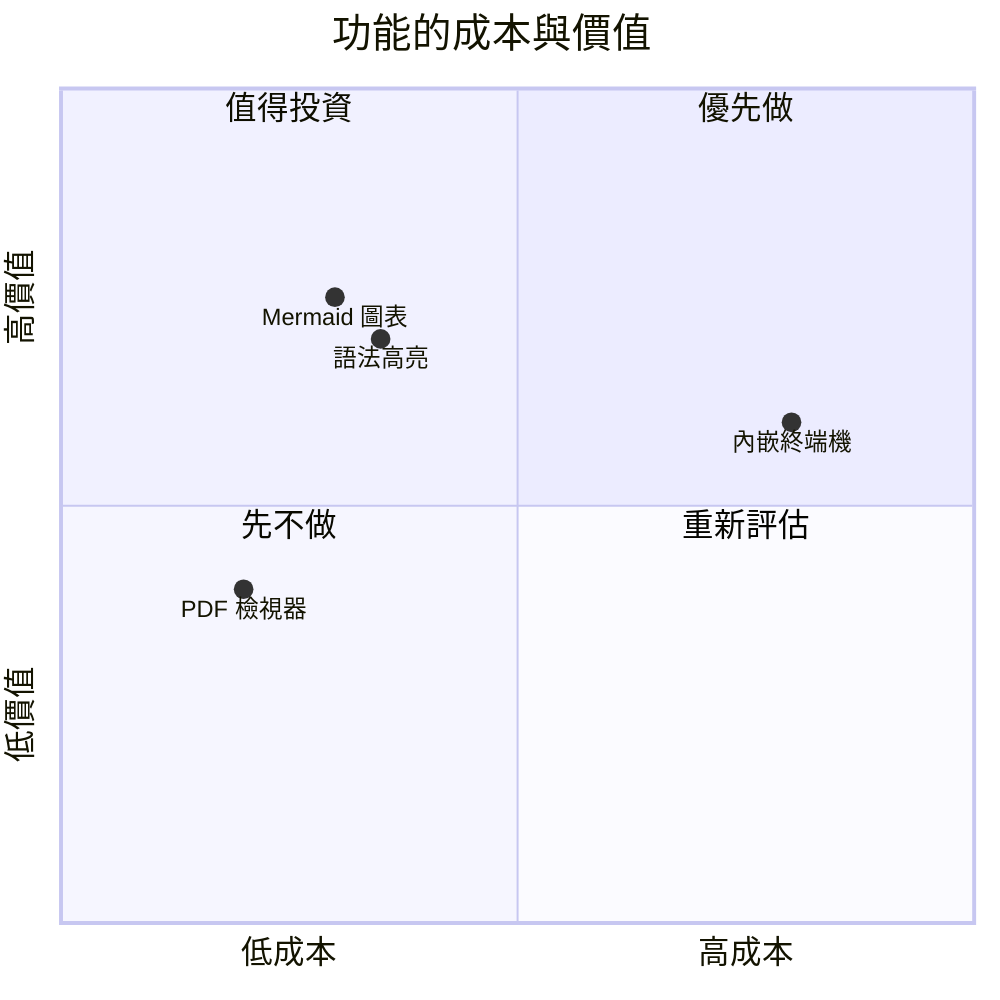
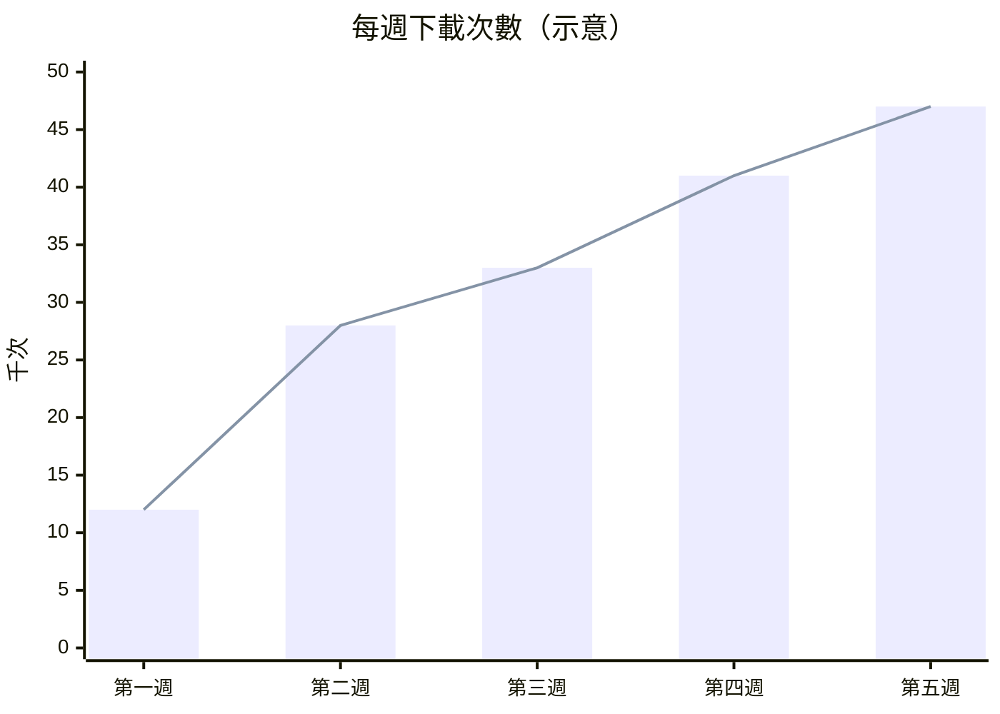
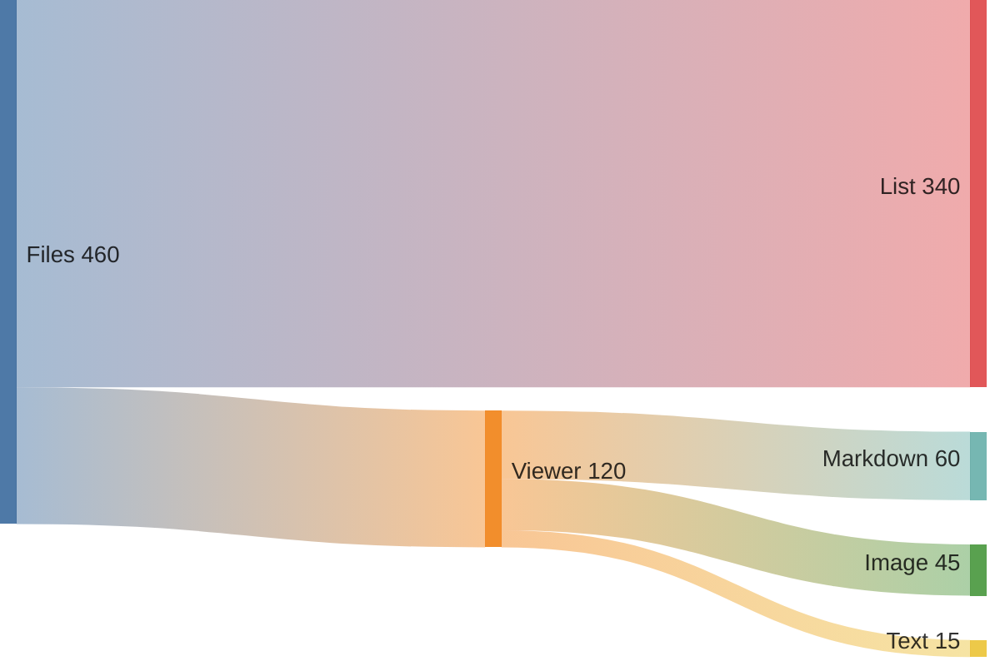
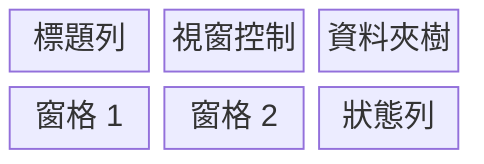
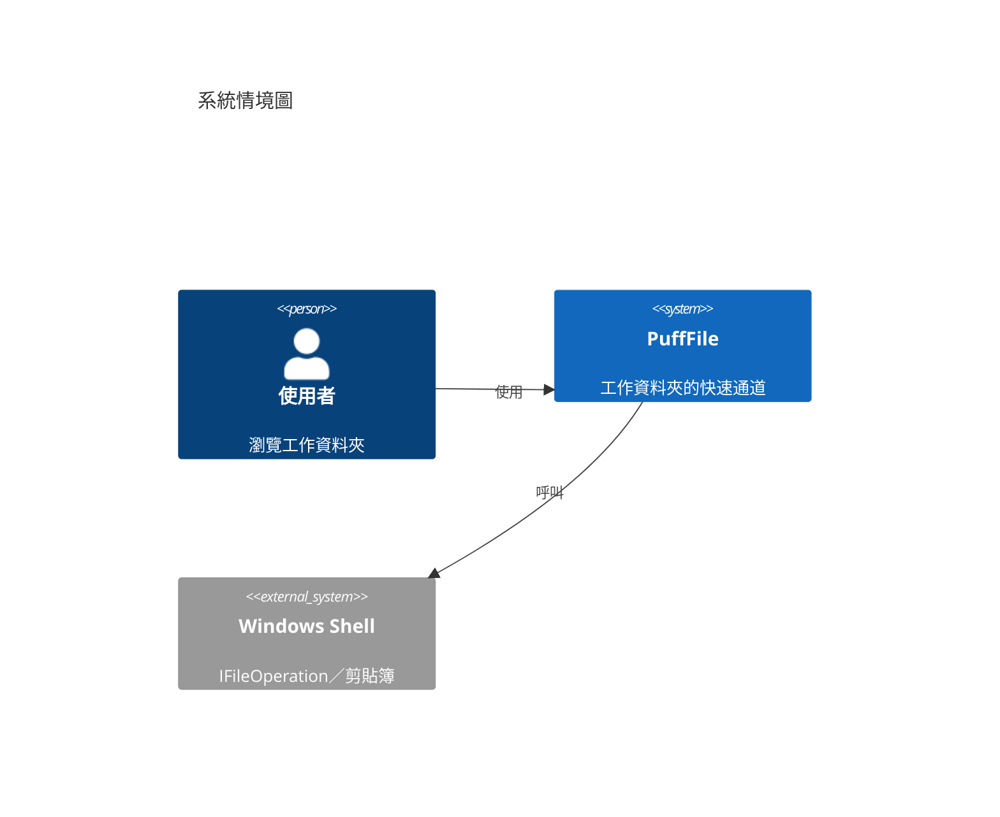
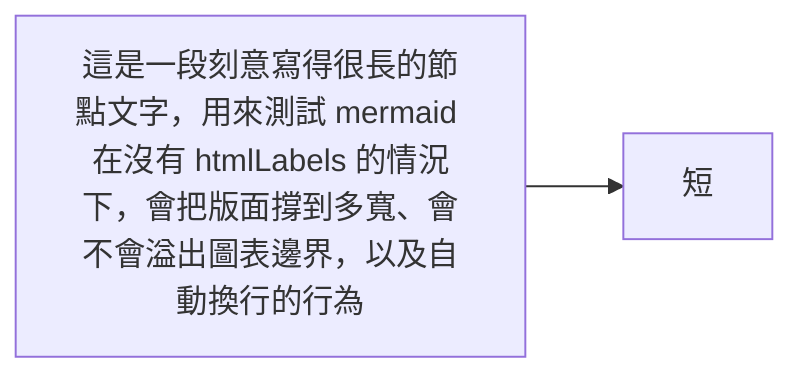

# Mermaid 測試 3：複雜與邊角案例

巢狀群組、樣式、實驗性圖表，以及**故意寫壞**的圖。

第 9 節是 mermaid 較新的圖表型別，如果渲染失敗先不用懷疑 PuffFile —— 失敗時檢視器
應該保留原始碼並顯示原因（這正是第 10.1 節要驗證的行為）。

## 1. 大型流程圖：巢狀群組＋樣式



## 2. 心智圖



## 3. 時間軸



## 4. 象限圖



## 5. XY 圖



## 6. 桑基圖

> mermaid 的 sankey 剖析器只吃 ASCII —— 中文（就算加引號）會被判成語法錯誤，
> 所以這一張刻意用英文標籤。



## 7. 區塊圖



## 8. C4 情境圖



## 9. 架構圖（實驗性）


## 10. 邊角案例

### 10.1 故意寫壞的圖

下面這張的 `{` 沒有收尾。**預期：保留原始碼並顯示失敗原因，不是一片空白。**

```mermaid
flowchart TD
    A[開始] --> B{還沒關閉的判斷
    B --> C[結束]
```

### 10.2 很長的節點文字

測試沒有 `htmlLabels` 時，過長的節點文字會不會把版面撐壞或溢出圖表邊界。



### 10.3 圖放在清單項目裡

縮排的圍籬區塊不保證會被解析成圖表；若這裡只顯示原始碼，屬於已知範圍。

- 清單裡的圖：

  ```mermaid
  flowchart LR
    X[清單裡的圖] --> Y[結束]
  ```

### 10.4 連續多張圖

確認同一份文件裡多張圖各自獨立渲染、互不影響，切換其中一張的「圖表／原始碼」
不會動到其他張。


